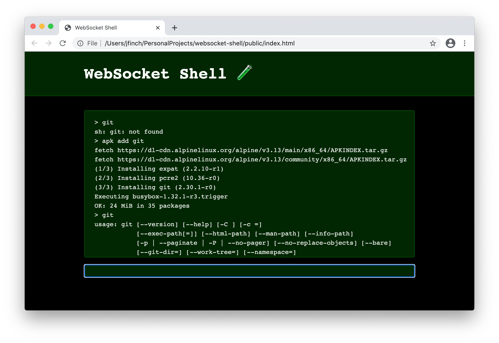

# WebSocket Shell Toy 🧪

A very crude experimental web portal into a terminal via WebSockets. It uses a PHP 8 backend with Ratchet PHP to provide the WebSockets support and Symfony Process to execute commands in a docker container.

To give it a go run: `make start`

Don't try this at home!